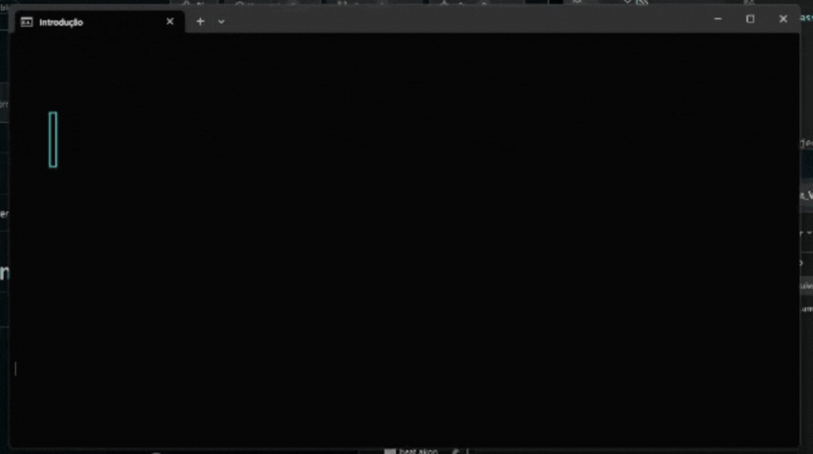

# Chat Virtual

## Introduction
“Chat Virtual” is a simple yet functional chatbot created using Windows batch scripting. This project is a nostalgic tribute to one of the early programming endeavors undertaken during childhood and early adolescence. Despite its simplicity, it demonstrates fundamental programming concepts and provides a basic interactive user experience.

## Features
- Interactive text-based chat interface with ASCII art animation.
- Basic text response logic.
- User input handling.
- Learning capability to remember new words and phrases.

## How to Run
1. Ensure you are using a Windows operating system.
2. Download the `chat_virtual.bat` file from the repository.
3. Double-click the `chat_virtual.bat` file to start the chatbot.
4. Follow the on-screen instructions and enjoy the chat experience.

## Usage
- Launch the script by double-clicking the `.bat` file.
- You will be greeted with a welcome screen featuring ASCII art animation.
- Press any key to start the chat.
- Interact with the chatbot by typing your responses and pressing Enter.
- Teach the chatbot new words and phrases by simply chatting with it.

<!--
## Future Improvements
- Enhance the chatbot's response logic for more intelligent interactions.
- Add more ASCII art for different stages of the chat.
- Implement external data files to expand the chatbot's knowledge base.
-->

## Contributing
Feel free to fork this project, make improvements, and submit pull requests. Your contributions are welcome!

## License
This project is licensed under the MIT License. See the LICENSE file for more details.
